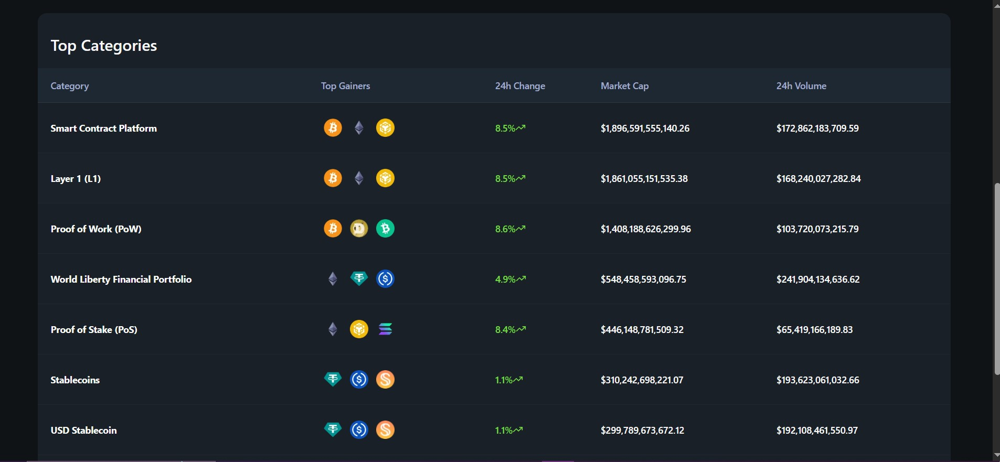
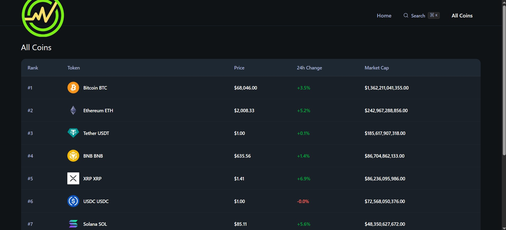
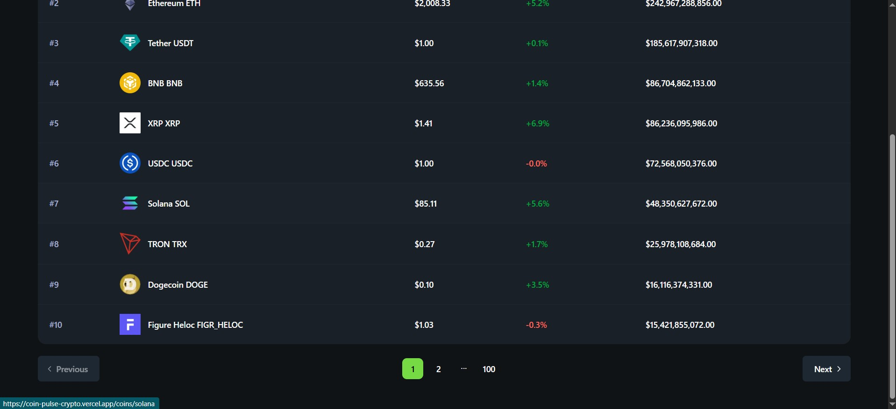
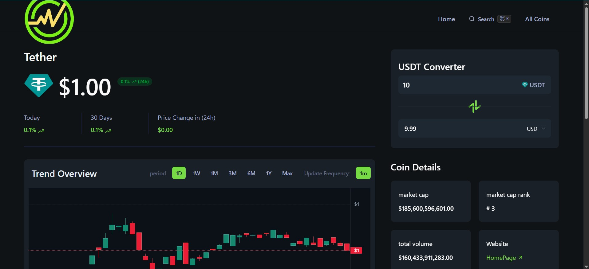
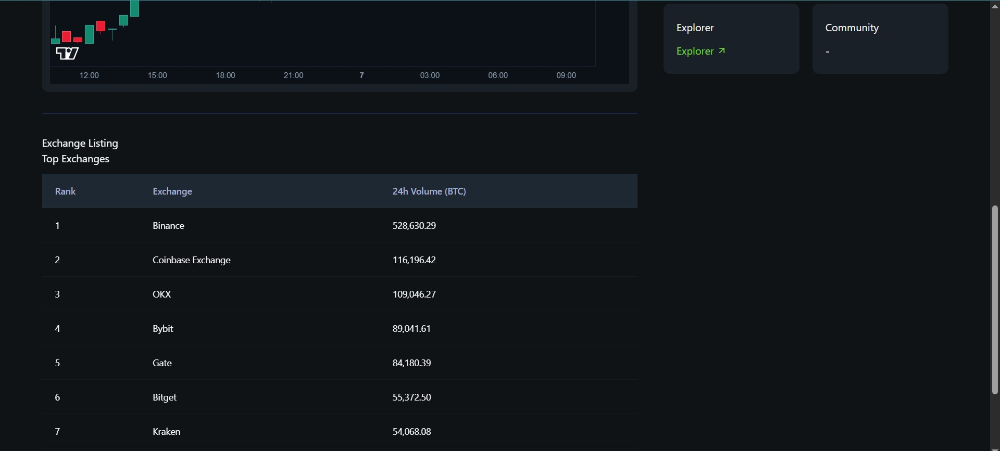

## 🌐 Live Demo

🔗 Production Deployment:
👉 https://coin-pulse-crypto.vercel.app/

📌 Overview

CoinPulse is a high-performance cryptocurrency market intelligence platform built to deliver real-time analytics, low-latency streaming data, and professional-grade financial visualizations.

The platform leverages Next.js 16, TailwindCSS v4, and shadcn/ui to provide a modular, scalable, and developer-friendly architecture.
It integrates CoinGecko’s REST API and WebSocket feeds to stream live price data, order book updates, and historical OHLCV metrics.

CoinPulse is designed for traders, analysts, fin tech developers, and data-driven crypto enthusiasts who need fast, accurate, and visually rich market insights.

🖼️ Screenshots
**Homepage Dashboard:**



**All Coins Market Table:**



**Token Detail Page:**



✨ Core Features
⚡ Real-Time Market Data
▪Live cryptocurrency price streaming via WebSockets
▪High-frequency market updates with minimal latency
▪Global crypto market statistics and dominance metrics

📈 Advanced Trading Visualizations
▪Interactive TradingView candlestick charts
▪OHLCV historical data visualization
▪Multi-timeframe chart controls (1D, 1W, 1M, 1Y, MAX)

🔎 Dynamic Token Pages
▪Detailed token analytics
▪Market cap, volume, rank, and price change metrics
▪Real-time fiat and crypto currency converter

📑 Advanced Search & Tables
▪Sortable and filterable coin market tables
▪Trending coins module
▪Real-time 24h price change tracking

🧩 Modular & Scalable UI
▪Component-driven architecture using shadcn/ui
▪TailwindCSS v4 utility-first design system
▪Next.js App Router and Server Components

🧠 Technology Stack

| Layer              | Technology                      |
| ------------------ | ------------------------------- |
| Frontend Framework | Next.js 16 (App Router)         |
| UI Components      | shadcn/ui                       |
| Styling            | TailwindCSS v4                  |
| Charts             | TradingView Charting Library    |
| Market Data        | CoinGecko REST API & WebSockets |
| Deployment         | Vercel                          |
| State/Data         | React Hooks + Server Components |

🏗️ System Architecture
User Browser
↓
Next.js 16 App Router
↓
Server Components & Client Components
↓
CoinGecko REST API + WebSocket Streams
↓
TradingView Chart Rendering Engine

📂 Project Structure

```
coinpulse/
├── components.json
├── constants.ts
├── eslint.config.mjs
├── next-env.d.ts
├── next.config.ts
├── package.json
├── postcss.config.mjs
├── README.md
├── tsconfig.json
├── type.d.ts
│
├── app/
│   ├── globals.css
│   ├── layout.tsx
│   ├── page.tsx
│   └── coins/
│       ├── page.tsx
│       └── [id]/
│
├── assets/
│   └── screenshots/
│
├── components/
│   ├── CandlestickCharts.tsx
│   ├── CoinHeader.tsx
│   ├── Converter.tsx
│   ├── DataTable.tsx
│   ├── ExchangeList.tsx
│   ├── FallBack.tsx
│   ├── Header.tsx
│   ├── LiveDataWrapper.tsx
│   ├── SearchModal.tsx
│   ├── home/
│   │   ├── categories.tsx
│   │   ├── CoinOverview.tsx
│   │   └── TrendingCoins.tsx
│   └── ui/
│       ├── badge.tsx
│       ├── button.tsx
│       ├── CoinPagination.tsx
│       ├── input.tsx
│       ├── pagination.tsx
│       ├── select.tsx
│       ├── separator.tsx
│       └── table.tsx
│
├── hooks/
│   ├── useCoinGeckoLiveData.ts
│   └── useCoinGeckoWebsocket.ts
│
├── lib/
│   ├── coingecko.actions.ts
│   └── utils.ts
│
└── public/
```

⚠️ Demo API Disclaimer

Important Notice
This project uses the CoinGecko Demo API tier, which is subject to strict rate limits and lower throughput.
As a result, real-time updates may experience latency or throttling under high traffic.

🚀 Usage
This is a deployed web platform. No installation is required.
Access the dashboard:

1-Open the live demo link
2-Explore global crypto market stats
3-Search for any cryptocurrency
4-View live charts and token analytics

🔐 Security & Data Integrity
▪Read-only analytics platform (no wallet or trading features)
▪Rate-limited external API requests
▪Error handling and fallback UI for API downtime

⚡ Performance Optimizations
▪Next.js Server Components & Edge Rendering
▪API caching and revalidation strategies
▪WebSocket streaming for real-time updates
▪TailwindCSS JIT compilation
▪Code splitting and lazy loading

👨‍💻 Author
Mohammed Almustafa Kamal
Frontend Engineer

⭐ Acknowledgements
▪CoinGecko API
▪TradingView
▪Next.js Team
▪shadcn/ui Community
